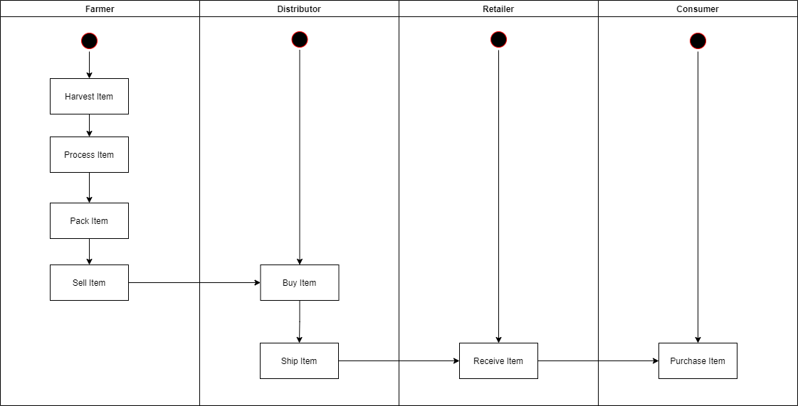
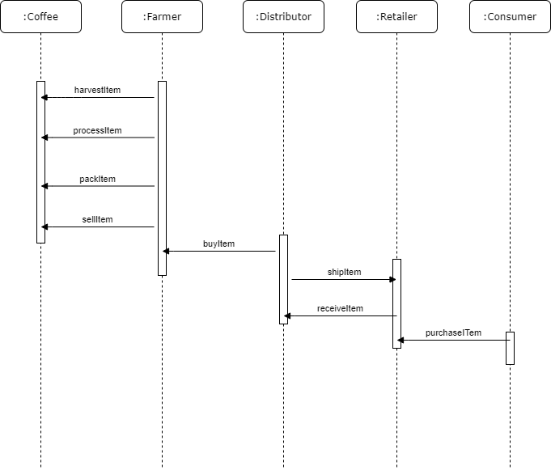
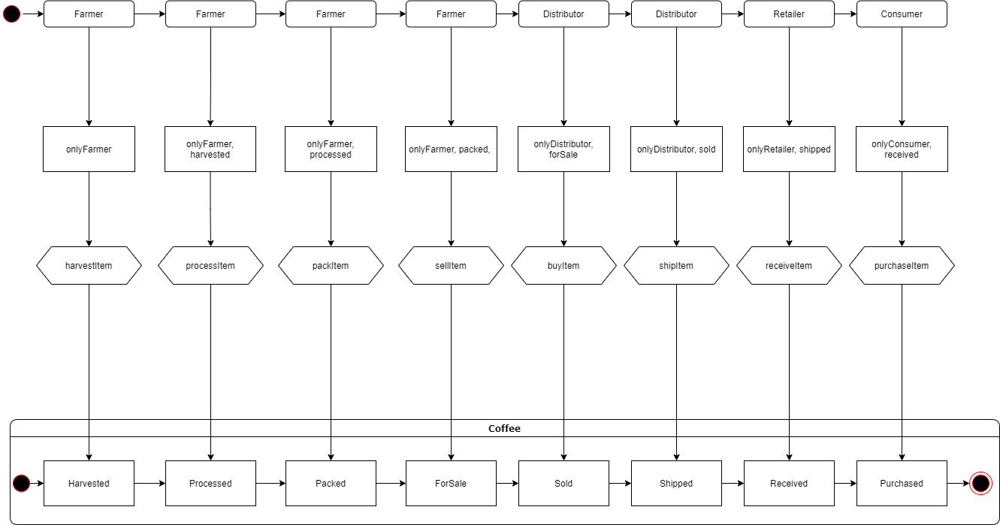
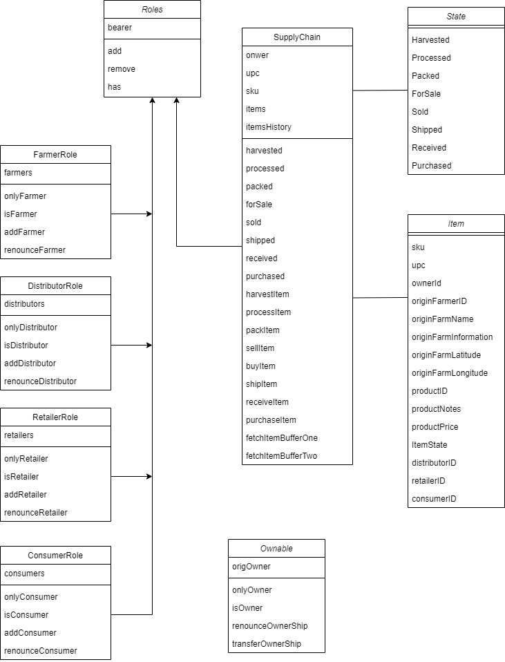

# Ethereum Dapp for Tracking Items through Supply Chain project submission  

### UML Diagrams
- Activity

- Sequence

- State

- Classes (Data Model)

### Libraries and versions used
- **Truffle version**: 4.1.14 - used for contract compilation, test and deployment
- **Node version**: 8.11.1 - runtime environment
- **Web3 version**: 1.2.1 - used for http interactions
- **HD Wallet Provider version**: 1.0.17 - wallet library used for deploying contracts to network

### Contracts deployed at Rinkeby
- FarmerRole: **contract**: 0x438e97b24770de6ec3850cfa7bf499e0a4e32014, **txID**:  0x8dfe9b5cd77a9d1d4cb558c01e71cdce0ad50b369218f1e890a75771a4fec757
- DistributorRole:**contract**: 0x1197f75dd43da9629be55fa1247c2b3d80b955b3, **txID**:  0xc496ba97209ce2259b8e240487b94c5b1d55bfb97b7c3674206c8776a75f8467
- RetailerRole: **contract**:  0x52bb8b89a43ecb691074786410e5bd8d07b8c1b2, **txID**:   0x4c854c22eb00c5357c02c52c4c11931ad861bdb27be2f16d1f65372e084d9055
- ConsumerRole: **contract**:  0xda969ad9689d5564df1bd18472f97a5101188008, **txID**:  0x13b499c8798fdaea52b8556e54e2a3fed068fee18e832679a95e62980a413d00
- SupplyChain: **contract**: 0x44c5fafdfb8067e96c34f1b0755a03ee7c32162e, **txID**:  0x7e51e2abc2c2475e73ddcc2a4de248c6ca540a89a39cd030f7f7e65354310120